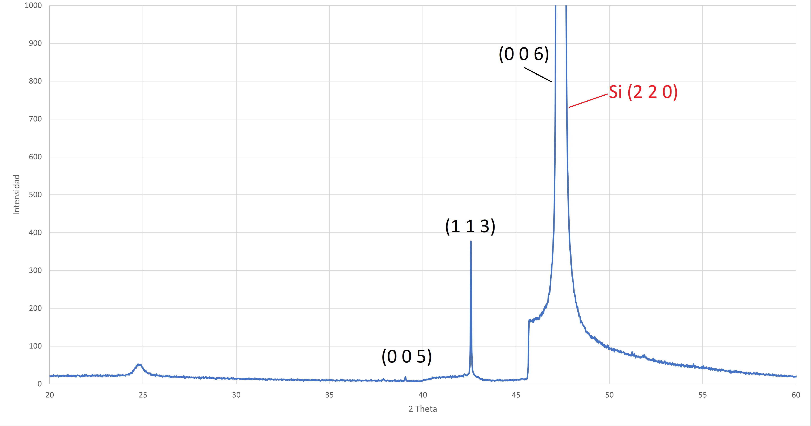
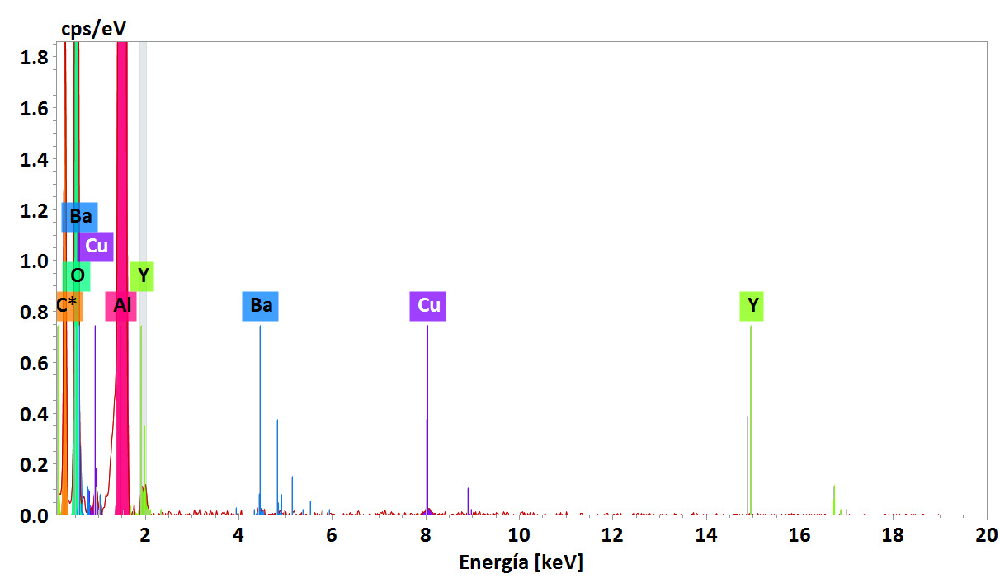

```{r, echo=FALSE}
xaringanExtra::use_panelset()
```

```{r xaringan-tile-view, echo=FALSE}
xaringanExtra::use_tile_view()
```
class: center, middle
# Deposicion de peliculas delgadas


1. Encendido de la bomba mecánica y esperar que haga vacío.

2. Prendemos la bomba de agua y encendemos las bombas turbomoleculares.

3. Iniciamos el proceso de desorción, el cual durará 1 hora.

4. 1 hora después de acabar el proceso de desorción, dejamos que fluya argón dentro de la cámara de sputtering.

5. Prendemos el calentador para obtener la temperatura deseada
en el sustrato.

6. Luego, dejamos fluir oxígeno y empezamos con el proceso de
sputtering.
---


# Condiciones de deposicion

Se depositó YBaCuO en un sustrato de silicio de 2.5cm × 2.5cm
bajo los siguientes parámetros durante 45 minutos:

1. DC$ V= 25 V $

2. I= 300 mA

3. $T_{sus}= 386^{\circ}$ 

4. $P= 1.9 \times 10^{-2} $ mbar
---

class: center
background-image: url("ybco_sem.jpg")

---
# Analisis de la muestra
.panelset[
.panel[.panel-name[DRX]


]

.panel[.panel-name[EDS]
```{r, echo=FALSE, out.width="70%"}

```
]
]
